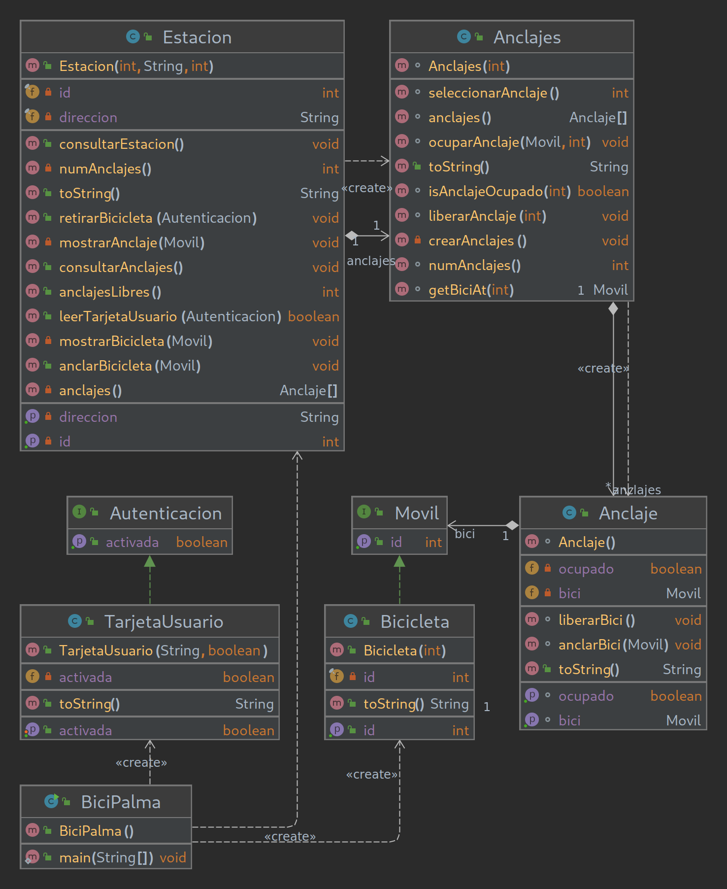

# Bicipalma

## I. Examen Programación DAW Dual
El GOIB necesita un nuevo programa para asignar las bicis y los anclajes del servicio Bicipalma.  
Crea el programa con la ayuda del diagrama UML.  

The GOIB needs a new program to assign the bikes and anchors of the Bicipalma service.  
Create the program with the help of the UML diagram.  

## Key-Concepts :dart: 
- Static Arrays
- Has-A
- Strong Composition
- Optional
- Streams

## UML
